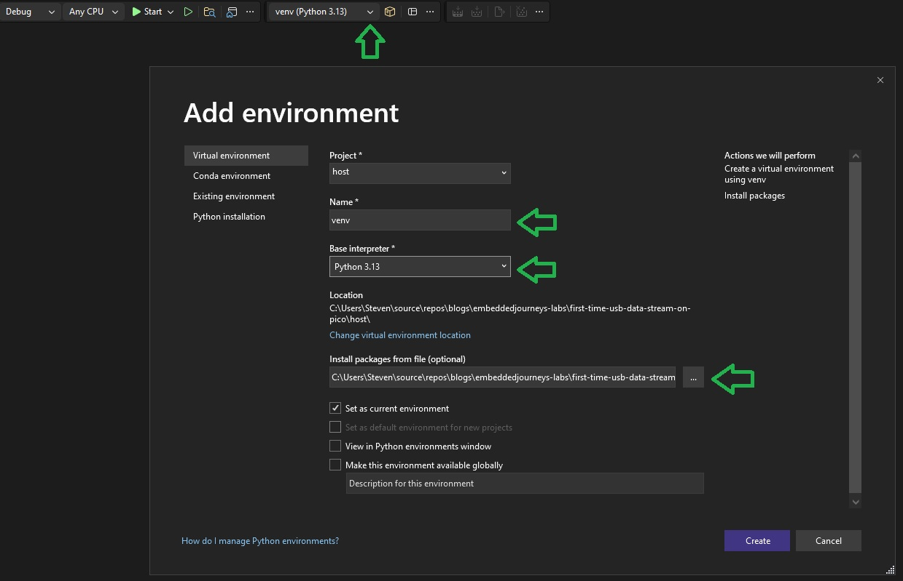

# README

This code goes with the corresponding [EmbeddedJourneys blog post](https://embeddedjourneys.com/blog/first-time-usb-data-stream-on-pico/) about setting up a first bulk USB data stream. A Raspberry Pico 2W is configured as a USB device using TinyUSB and generates a cosine wave with a period of 2s. The generated data is then streamed over USB to a python host application, which visualizes the cosine wave.

This folder contains the following 2 subfolders:

## Firmware
Contains the source code for the USB device, which is intended to run on a Raspberry Pi Pico 2W (A Pico 2 should work as well though)

## Host
Contains the python application code to visualize the data streamed from the USB device. 

Apart from what is mentioned in the blog post, please note that I have been using a Python environment in visual studio community. I have been running Python 3.13. Just for this code to run, you'll need to add an environment with Name *venv* and as base interpreter you could choose the Python 3.13. In the Host folder, you'll find a requirements.txt file that should be selected in "Install packages from file" so you get the correct dependencies in that environment. Cf. green arrows in the image below.

